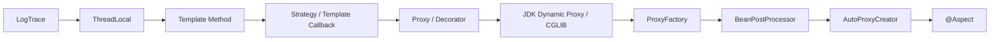

# Spring Core Advanced

> 김영한님의 인프런 강의 **「스프링 핵심 원리 - 고급편」**을 학습하며  
> **로그 추적기 구현에서 시작해 Spring AOP가 동작하는 구조까지** 단계적으로 실습한 저장소입니다.

<p>
  
  
  
  
</p>

<br>

## About

단순히 Spring AOP의 애노테이션 사용법을 익히는 것이 아니라,

> **왜 AOP가 필요한가?**  
> **프록시는 어떻게 만들어지는가?**  
> **Spring은 어떻게 대상 빈을 찾아 프록시로 교체하는가?**

를 직접 코드를 개선해가며 이해하는 것을 목표로 했습니다.

로그 추적 기능을 애플리케이션에 적용하면서 발생하는 **중복 코드, 동시성 문제, 프록시 생성 코드의 반복**을 하나씩 해결하고, 최종적으로 `@Aspect` 기반의 Spring
AOP 구조까지 발전시켰습니다.

<br>

## Learning Journey



핵심은 새로운 기술을 하나씩 추가하는 것이 아니라,  
**이전 방식의 문제를 다음 단계의 기술로 해결하는 과정**을 이해하는 것입니다.

<br>

## 핵심 학습 흐름

### 1. 로그 추적기 구현

Controller → Service → Repository로 이어지는 요청 흐름을 추적하기 위한 `LogTrace`를 구현했습니다.

```text
OrderController.request()
        ↓
OrderService.orderItem()
        ↓
OrderRepository.save()
```

로그를 통해 다음 정보를 확인할 수 있도록 구성했습니다.

- 요청 단위 Trace ID
- 메서드 호출 깊이
- 실행 시간
- 정상 종료 여부
- 예외 발생 여부

초기에는 `TraceId`를 직접 파라미터로 전달하며 호출 깊이를 동기화했습니다.

```text
Controller
   ↓ TraceId
Service
   ↓ TraceId
Repository
```

하지만 로그 추적을 위해 비즈니스 메서드의 파라미터까지 변경해야 한다는 문제가 있었습니다.

---

### 2. ThreadLocal과 동시성

`TraceId`를 메서드 파라미터로 전달하지 않기 위해 필드에 저장했지만, 여러 요청이 동시에 접근하면서 **동시성 문제**가 발생했습니다.

```text
Thread-A ─┐
          ├─ shared field
Thread-B ─┘
```

이를 `ThreadLocal`로 변경하여 각 스레드가 자신만의 데이터를 관리하도록 개선했습니다.

```text
Thread-A → ThreadLocal A

Thread-B → ThreadLocal B
```

주요 학습 내용:

- 동시성 문제가 발생하는 조건
- 지역 변수와 인스턴스 필드의 차이
- `ThreadLocal.set()`
- `ThreadLocal.get()`
- `ThreadLocal.remove()`
- WAS Thread Pool 환경에서 값 제거가 중요한 이유

특히 Thread Pool에서는 스레드가 재사용되기 때문에 `ThreadLocal.remove()`를 호출하지 않으면 이전 요청의 데이터가 다음 요청에 남을 수 있다는 점을
확인했습니다.

---

### 3. 핵심 기능과 부가 기능 분리

로그 추적기를 실제 애플리케이션에 적용하면서 다음과 같은 코드가 반복되었습니다.

```java
TraceStatus status = null;

try{
status =trace.

begin("message");

// 핵심 기능

    trace.

end(status);
}catch(
Exception e){
        trace.

exception(status, e);
    throw e;
}
```

여기서 코드를 두 가지 역할로 나누어 바라봤습니다.

```text
핵심 기능
→ 주문, 저장 등 객체 본연의 기능

부가 기능
→ 로그 추적, 실행 시간 측정 등
```

이를 통해 좋은 설계에서 중요한

> **변하는 것과 변하지 않는 것을 분리한다**

는 원칙을 학습했습니다.

---

### 4. Template Method / Strategy / Template Callback

반복되는 로그 추적 구조와 실제 비즈니스 로직을 분리하기 위해 여러 디자인 패턴을 적용했습니다.

#### Template Method

```text
부모 클래스
 ├─ 공통 로직
 └─ abstract call()
          ↑
       자식 클래스
```

상속을 이용하여 변하지 않는 로직과 변하는 로직을 분리했습니다.

#### Strategy

```text
Context
   ↓
Strategy
   ↓
ConcreteStrategy
```

상속 대신 위임을 사용하여 실행 전략을 외부에서 주입하도록 변경했습니다.

#### Template Callback

```text
Template
   ↓
Callback
```

전략 패턴을 익명 내부 클래스와 람다를 이용한 Callback 형태로 발전시켰습니다.

이를 통해 Spring 내부에서도 자주 사용되는 **Template + Callback 구조**를 이해했습니다.

---

### 5. Proxy Pattern / Decorator Pattern

기존 비즈니스 코드를 수정하지 않고 부가 기능을 적용하기 위해 프록시를 도입했습니다.

```text
Client
  ↓
Proxy
  ↓
Target
```

프록시는 접근 제어와 부가 기능 추가라는 서로 다른 목적으로 사용할 수 있습니다.

| 패턴              | 목적             |
|-------------------|------------------|
| Proxy Pattern     | 접근 제어        |
| Decorator Pattern | 새로운 기능 추가 |

인터페이스 기반 프록시뿐만 아니라 구체 클래스를 상속하는 클래스 기반 프록시도 직접 구현했습니다.

```text
Interface Proxy
Concrete Class Proxy
```

이를 통해 클라이언트가 실제 객체인지 프록시 객체인지 알 필요 없이 동일한 인터페이스로 사용할 수 있다는 점을 확인했습니다.

---

### 6. JDK Dynamic Proxy / CGLIB

직접 프록시 클래스를 만들면 대상 클래스가 증가할수록 동일한 형태의 프록시 클래스가 계속 증가합니다.

```text
Target A → Proxy A
Target B → Proxy B
Target C → Proxy C
...
```

이를 해결하기 위해 **동적 프록시**를 학습했습니다.

#### Reflection

```java
Method method = clazz.getMethod("call");
method.

invoke(target);
```

메서드 메타정보를 이용하여 호출 대상을 런타임에 결정하는 구조를 이해했습니다.

#### JDK Dynamic Proxy

인터페이스를 기반으로 런타임에 프록시 객체를 생성합니다.

```text
Proxy
  ↓
InvocationHandler
  ↓
Target
```

#### CGLIB

구체 클래스를 상속하여 동적으로 프록시를 생성합니다.

```text
Proxy
  ↓
MethodInterceptor
  ↓
Target
```

이를 통해 프록시 클래스를 직접 작성하지 않고 공통 부가 기능을 여러 대상에 적용할 수 있게 되었습니다.

---

### 7. Spring ProxyFactory

JDK Dynamic Proxy와 CGLIB는 각각 사용하는 API가 다릅니다.

```text
JDK Dynamic Proxy
→ InvocationHandler

CGLIB
→ MethodInterceptor
```

Spring은 이를 `ProxyFactory`로 추상화합니다.

```text
             ┌─ JDK Dynamic Proxy
ProxyFactory ┤
             └─ CGLIB
```

따라서 개발자는 구체적인 프록시 기술보다 **부가 기능 자체에 집중**할 수 있습니다.

이 과정에서 Spring AOP의 핵심 개념을 학습했습니다.

```text
Pointcut
→ 어디에 적용할 것인가?

Advice
→ 무엇을 적용할 것인가?

Advisor
→ Pointcut + Advice
```

```text
Advisor
   ├─ Pointcut
   └─ Advice
```

---

### 8. BeanPostProcessor

`ProxyFactory`를 사용해도 Controller, Service, Repository 각각에 대해 프록시를 생성하는 설정 코드가 필요했습니다.

```text
Configuration
     ↓
ProxyFactory
     ↓
Proxy
     ↓
Spring Bean
```

이를 개선하기 위해 `BeanPostProcessor`를 사용했습니다.

```text
Spring
  ↓
Bean 생성
  ↓
BeanPostProcessor
  ↓
Proxy 생성
  ↓
Proxy를 Bean으로 등록
```

빈 후처리기는 객체가 Spring Bean 저장소에 등록되기 전에 개입하여

- 객체를 수정하거나
- 원본 객체를 반환하거나
- 완전히 다른 객체로 교체

할 수 있습니다.

이를 이용해 원본 객체 대신 프록시 객체를 Spring Bean으로 등록하도록 구현했습니다.

---

### 9. AutoProxyCreator

직접 `BeanPostProcessor`를 구현하는 과정 역시 Spring이 자동화할 수 있습니다.

Spring의 자동 프록시 생성기인

```text
AnnotationAwareAspectJAutoProxyCreator
```

를 이용하면 개발자가 직접 프록시를 생성할 필요가 없습니다.

```text
Spring Bean 생성
       ↓
AutoProxyCreator
       ↓
Advisor 조회
       ↓
Pointcut 검사
       ↓
Proxy 필요?
   ↙         ↘
 YES         NO
 ↓            ↓
Proxy       Original
 ↓            ↓
Spring Bean 등록
```

개발자가 해야 하는 작업은 다음과 같이 줄어듭니다.

```text
Pointcut
   +
Advice
   ↓
Advisor Bean 등록
```

또한 `AspectJExpressionPointcut`을 사용하여 패키지와 메서드를 세밀하게 지정했습니다.

```java
execution(*hello.advanced.proxy.app ..*(..))
```

특정 메서드는 부정 조건을 이용하여 제외했습니다.

```java
execution(*hello.advanced.proxy.app ..*(..))
        &&
        !

execution(*hello.advanced.proxy.app ..noLog(..))
```

---

### 10. @Aspect

최종적으로 직접 `Advisor`를 생성하는 과정도 `@Aspect`를 이용해 단순화했습니다.

```java

@Aspect
public class LogTraceAspect {

    @Around("execution(* hello.advanced.proxy.app..*(..))")
    public Object execute(ProceedingJoinPoint joinPoint) throws Throwable {
        // LogTrace
        return joinPoint.proceed();
    }
}
```

`@Around`에는

```text
Pointcut + Advice
```

가 함께 표현됩니다.

Spring의 자동 프록시 생성기는 `@Aspect`가 붙은 Bean을 찾아 내부적으로 Advisor로 변환합니다.

```text
@Aspect
   ↓
Aspect 분석
   ↓
Advisor 생성
   ↓
AutoProxyCreator
   ↓
Pointcut 검사
   ↓
Proxy 생성
   ↓
Spring Bean 등록
```

최종적으로 로그 추적이라는 횡단 관심사를 비즈니스 코드에서 완전히 분리할 수 있었습니다.

<br>

## Proxy 적용 방식의 발전

이번 실습에서 가장 중요하게 본 흐름입니다.

```text
비즈니스 코드에 LogTrace 직접 작성
                ↓
Template Method
                ↓
Strategy / Template Callback
                ↓
직접 Proxy 구현
                ↓
JDK Dynamic Proxy / CGLIB
                ↓
ProxyFactory
                ↓
BeanPostProcessor
                ↓
AnnotationAwareAspectJAutoProxyCreator
                ↓
@Aspect
```

각 단계는 이전 방식의 문제점을 해결합니다.

| 단계                | 해결한 문제                            |
|---------------------|----------------------------------------|
| 직접 LogTrace 적용  | 로그 추적 기능 구현                    |
| ThreadLocal         | 요청 간 TraceId 동시성 문제            |
| Template / Strategy | 반복되는 부가 기능 코드                |
| Proxy               | 비즈니스 코드와 부가 기능 결합         |
| Dynamic Proxy       | 대상마다 프록시 클래스를 작성하는 문제 |
| ProxyFactory        | JDK Proxy / CGLIB 기술 의존            |
| BeanPostProcessor   | 빈마다 ProxyFactory를 생성하는 문제    |
| AutoProxyCreator    | BeanPostProcessor 직접 구현            |
| `@Aspect`           | Advisor를 직접 구성하는 코드           |

<br>

## Spring AOP를 바라보는 관점

이번 실습을 통해 `@Aspect` 자체보다 그 아래에서 동작하는 구조를 이해하는 데 집중했습니다.

```text
@Aspect
   ↓
Advisor
   ↓
Pointcut + Advice
   ↓
AnnotationAwareAspectJAutoProxyCreator
   ↓
ProxyFactory
   ↓
Proxy
   ↓
Target
```

즉,

```java
@Aspect
@Around(...)
```

를 사용하는 짧은 코드 뒤에는

```text
동적 프록시
ProxyFactory
Advisor
BeanPostProcessor
AutoProxyCreator
```

가 연결되어 있습니다.

<br>

## 주요 학습 내용

- 로그 추적기 직접 구현
- `TraceId`와 호출 Level 동기화
- 멀티스레드 환경의 동시성 문제
- `ThreadLocal`의 동작 원리와 주의사항
- Template Method Pattern
- Strategy Pattern
- Template Callback Pattern
- Proxy Pattern
- Decorator Pattern
- Reflection
- JDK Dynamic Proxy
- CGLIB
- `InvocationHandler`
- `MethodInterceptor`
- Spring `ProxyFactory`
- `Advice`
- `Pointcut`
- `Advisor`
- `BeanPostProcessor`
- `AnnotationAwareAspectJAutoProxyCreator`
- `AspectJExpressionPointcut`
- `@Aspect`
- `@Around`
- `ProceedingJoinPoint`
- 횡단 관심사와 AOP

<br>

## Package Structure

```text
src
├── main
│   └── java
│       └── hello
│           └── advanced
│               ├── example
│               │   └── app
│               │       ├── v0
│               │       ├── v1
│               │       ├── v2
│               │       ├── v3
│               │       ├── v4
│               │       └── v5
│               │
│               ├── proxy
│               │   ├── app
│               │   │   ├── v1
│               │   │   ├── v2
│               │   │   └── v3
│               │   │
│               │   └── config
│               │       ├── v1_proxy
│               │       ├── v2_dynamicproxy
│               │       ├── v3_proxyfactory
│               │       ├── v4_postprocessor
│               │       ├── v5_autoproxy
│               │       └── v6_aop
│               │
│               └── trace
│                   ├── hellotrace
│                   ├── logtrace
│                   ├── template
│                   └── callback
│
└── test
    └── java
        └── hello
            └── advanced
                ├── proxy
                │   ├── pureproxy
                │   ├── jdkdynamic
                │   ├── cglib
                │   ├── proxyfactory
                │   ├── postprocessor
                │   └── advisor
                │
                └── trace
                    ├── template
                    ├── strategy
                    └── threadlocal
```

각 버전을 유지하여 **동일한 문제를 어떤 방식으로 개선했는지 비교할 수 있도록 구성**했습니다.

<br>

## 학습 포인트

이번 실습에서 가장 중요하게 가져간 질문은 다음과 같습니다.

### 왜 핵심 기능과 부가 기능을 분리해야 하는가?

```text
핵심 기능
+
로그 / 트랜잭션 / 모니터링
```

이 한 곳에 섞이면 기능이 증가할수록 비즈니스 코드가 복잡해집니다.

---

### 왜 프록시가 필요한가?

기존 코드를 수정하지 않고 부가 기능을 적용하기 위해서입니다.

```text
Client
  ↓
Proxy
  ↓
Target
```

---

### 왜 ProxyFactory가 필요한가?

JDK Dynamic Proxy와 CGLIB라는 구체적인 프록시 기술을 추상화하기 위해서입니다.

---

### 왜 BeanPostProcessor가 필요한가?

개발자가 모든 Spring Bean에 대해 직접 Proxy를 생성하지 않아도 되도록 빈 등록 과정 자체에 개입하기 위해서입니다.

---

### 왜 AutoProxyCreator가 필요한가?

Proxy 생성과 Bean 교체 과정까지 Spring에 위임하고 개발자는 `Advisor`에 집중하기 위해서입니다.

---

### 왜 @Aspect를 사용하는가?

최종적으로 Pointcut과 Advice를 선언적으로 표현하고 횡단 관심사를 하나의 모듈로 관리하기 위해서입니다.

<br>

## 강의 정보

- 강의명: [스프링 핵심 원리 - 고급편](https://www.inflearn.com/course/%EC%8A%A4%ED%94%84%EB%A7%81-%ED%95%B5%EC%8B%AC-%EC%9B%90%EB%A6%AC-%EA%B3%A0%EA%B8%89%ED%8E%B8)
- 강사: 김영한
- 플랫폼: Inflearn

<br>

## Reference

- [Spring Framework Documentation](https://docs.spring.io/spring-framework/reference/)
- [Java ThreadLocal API](https://docs.oracle.com/en/java/javase/21/docs/api/java.base/java/lang/ThreadLocal.html)

<br>

## 저작권 및 출처

이 저장소는 **김영한님의 「스프링 핵심 원리 - 고급편」 강의를 수강하며 학습한 내용을 개인적으로 정리한 저장소**입니다.

강의 자료와 예제 코드의 저작권은 원저작자에게 있으며, 유료 강의 자료의 원문을 그대로 공유하지 않습니다.

저장소에는 직접 작성한 실습 코드와 학습 과정에서 이해한 내용을 중심으로 기록합니다.
